# Gameplay Diagrams - Visual Workflow

This document contains visual diagrams for the gameplay workflow using Mermaid syntax.

## Table of Contents

1. [Game Lifecycle Diagram](#game-lifecycle-diagram)
2. [Initialization Flow](#initialization-flow)
3. [Turn Flow Diagram](#turn-flow-diagram)
4. [State Machine Diagrams](#state-machine-diagrams)
5. [Player Actions Flow](#player-actions-flow)
6. [Piece Movement Logic](#piece-movement-logic)
7. [Interaction Resolution](#interaction-resolution)
8. [Sequence Diagrams](#sequence-diagrams)

---

## Game Lifecycle Diagram

### Complete Game Flow

```mermaid
graph TB
    Start([Game Start]) --> CreateRoom[Create Room]
    CreateRoom --> CreateMatch[Create Match]
    CreateMatch --> JoinPlayers[Players Join Match]
    JoinPlayers --> CheckPlayers{4 Players?}
    CheckPlayers -->|No| WaitMore[Wait for More Players]
    WaitMore --> JoinPlayers
    CheckPlayers -->|Yes| StartMatch[Start Match]
    StartMatch --> InitGame[Initialize Game]
    
    InitGame --> RandomizeOrder[Randomize Player Order]
    RandomizeOrder --> CreateBoard[Create Board State]
    CreateBoard --> CreatePieces[Create Pieces]
    CreatePieces --> CreateBalances[Create Player Balances]
    CreateBalances --> CreateDicePool[Create Dice Pool]
    CreateDicePool --> GameReady[Game Ready]
    
    GameReady --> GameLoop{Game Loop}
    
    GameLoop --> TurnStart[Turn Start]
    TurnStart --> RollDice[Roll Dice]
    RollDice --> CheckDouble{Is Double?}
    CheckDouble -->|Yes| CheckDoubleCount{DoubleCount < 3?}
    CheckDoubleCount -->|Yes| MovePiece[Move Piece]
    CheckDoubleCount -->|No| EndTurn[End Turn]
    CheckDouble -->|No| MovePiece
    
    MovePiece --> CalculatePosition[Calculate Position]
    CalculatePosition --> HandleSpecialCases[Handle Special Cases]
    HandleSpecialCases --> ResolveInteractions[Resolve Interactions]
    ResolveInteractions --> UpdatePiece[Update Piece]
    UpdatePiece --> RecordHistory[Record History]
    RecordHistory --> CheckDoubleTurn{Double < 3?}
    
    CheckDoubleTurn -->|Yes| ExtraTurn[Extra Turn]
    ExtraTurn --> RollDice
    CheckDoubleTurn -->|No| EndTurn
    
    EndTurn --> CheckEndGame{End Game?}
    CheckEndGame -->|No| NextPlayer[Next Player]
    NextPlayer --> TurnStart
    CheckEndGame -->|Yes| GameFinished[Game Finished]
    
    GameFinished --> End([End])
    
    style Start fill:#4CAF50,stroke:#2E7D32,color:#FFFFFF
    style End fill:#E53935,stroke:#B71C1C,color:#FFFFFF
    style GameReady fill:#1976D2,stroke:#0D47A1,color:#FFFFFF
    style GameFinished fill:#FFB300,stroke:#F57F17,color:#111111
```

---

## Initialization Flow

### Game Initialization Process

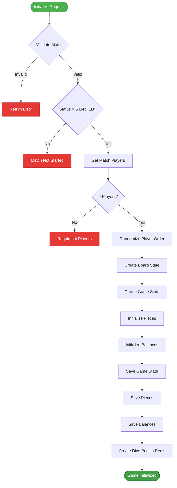

---

## Turn Flow Diagram

### Complete Turn Cycle

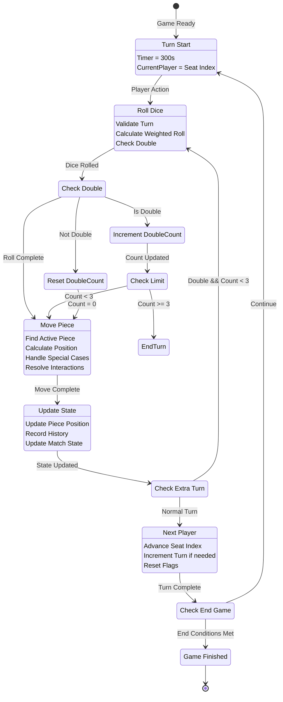

---

## State Machine Diagrams

### Game Status State Machine

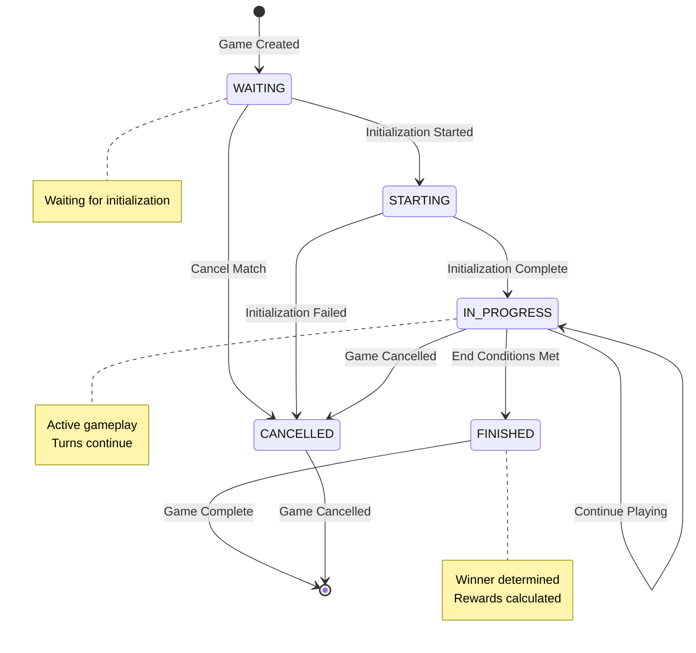

### Match Status State Machine

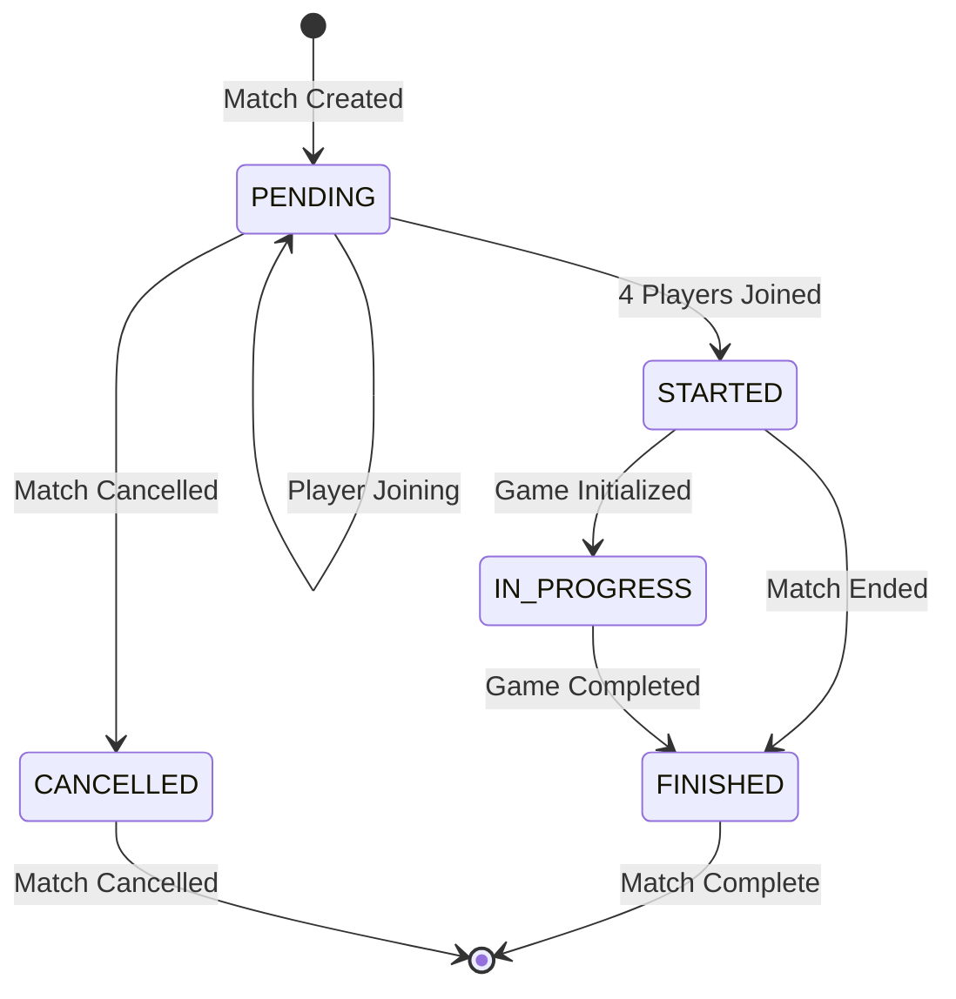

### Turn State Machine

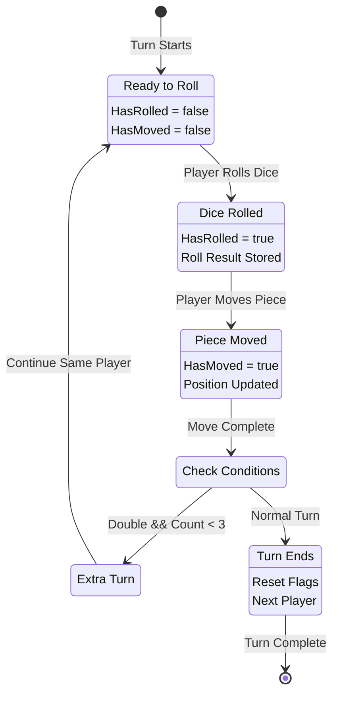

---

## Player Actions Flow

### Roll Dice Flow

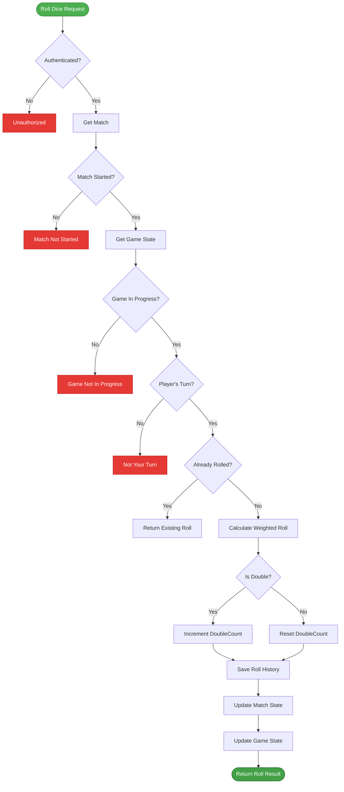

### Move Piece Flow

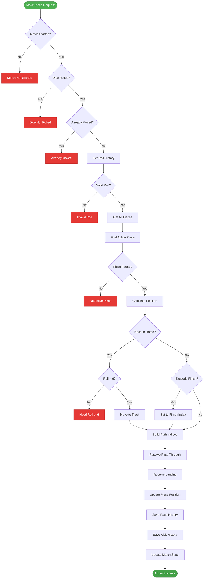

---

## Piece Movement Logic

### Position Calculation Flow

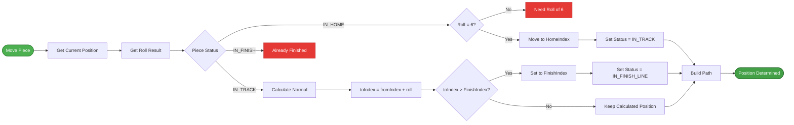

---

## Interaction Resolution

### Enemy Piece Interaction Flow

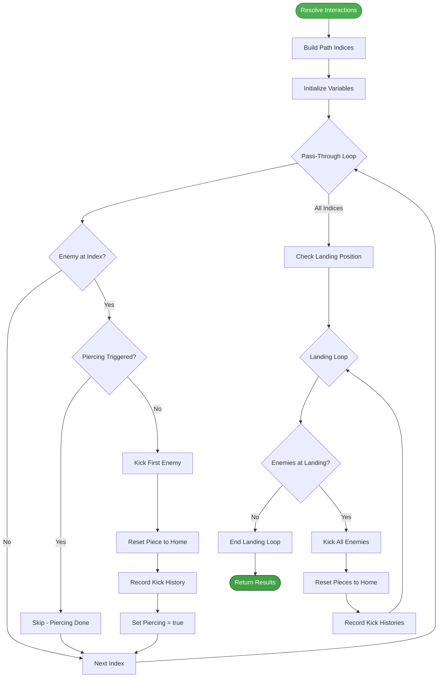

### Pass-Through vs Landing Interaction

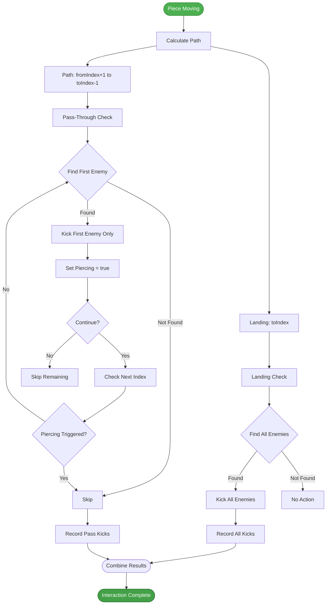

---

## Sequence Diagrams

### Complete Turn Sequence

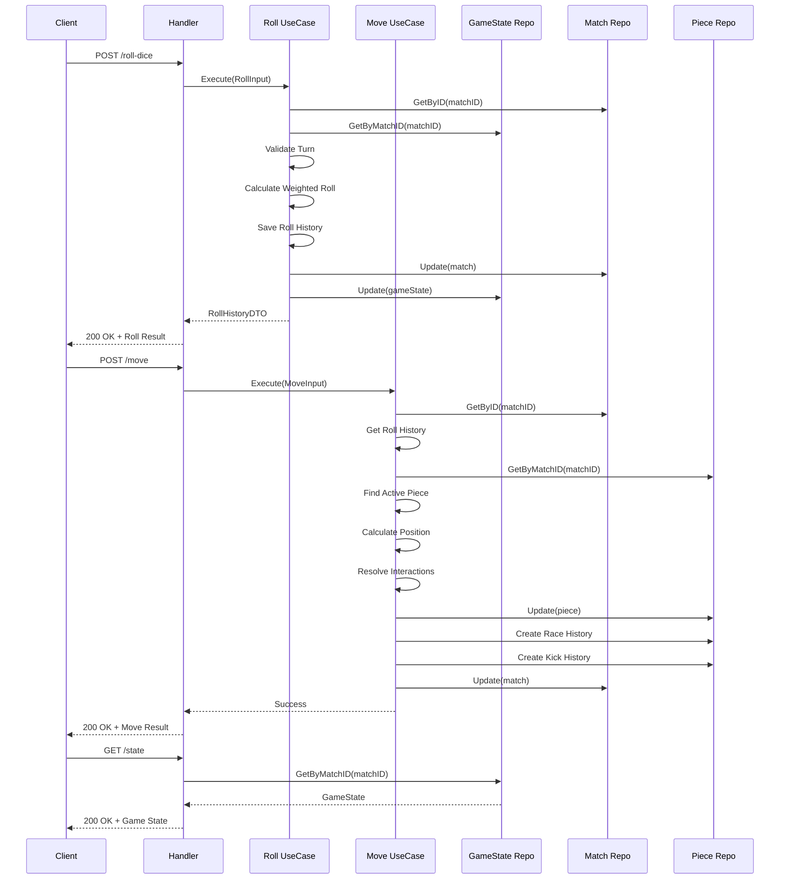

### Game Initialization Sequence

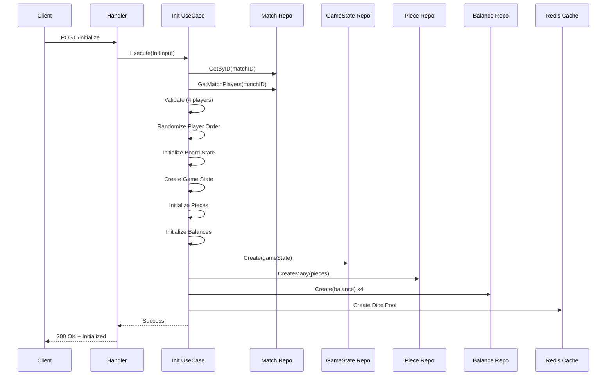

### Piece Interaction Sequence

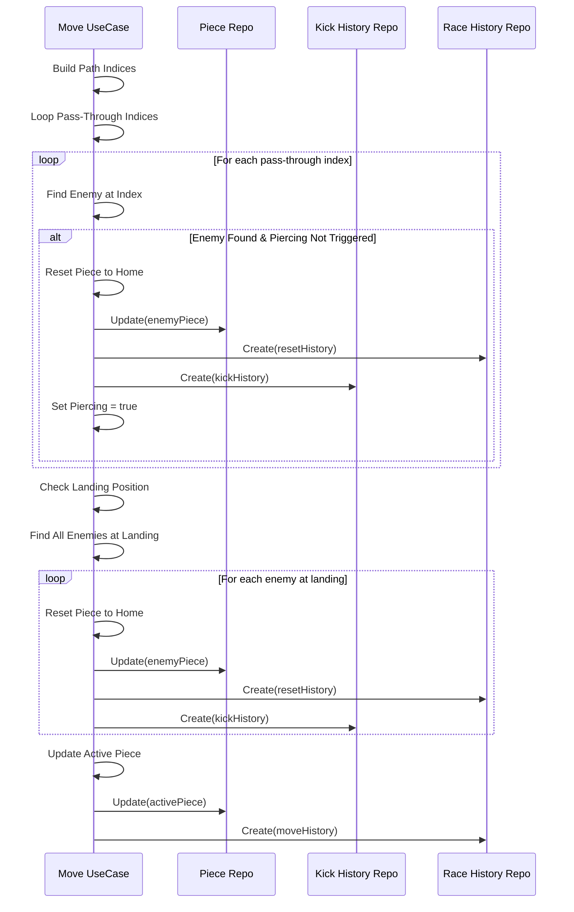

---

## Board Layout Diagram

### 56-Cell Board Structure

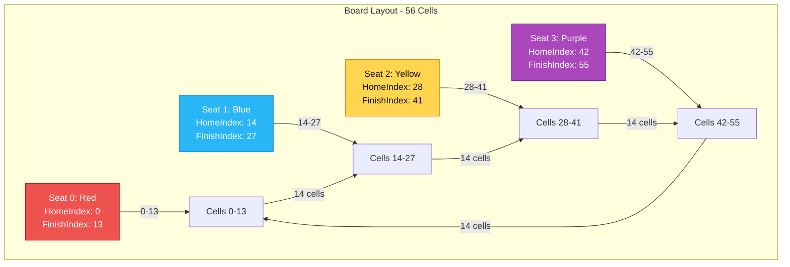

---

## Doubles Logic Diagram

### Double Handling Flow

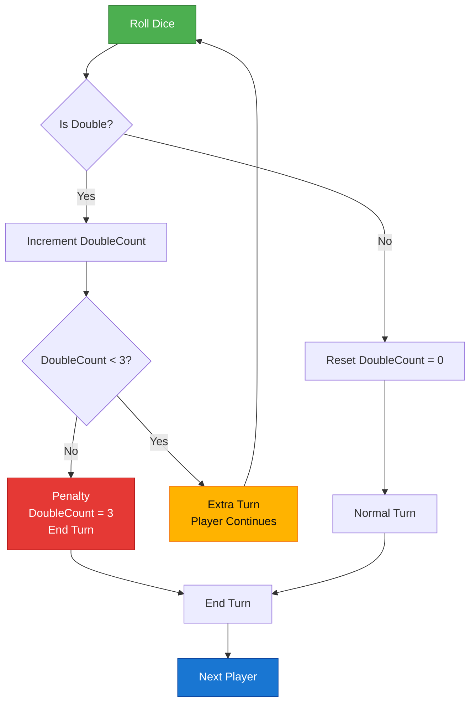

---

## Timer Flow Diagram

### Turn Timer Management

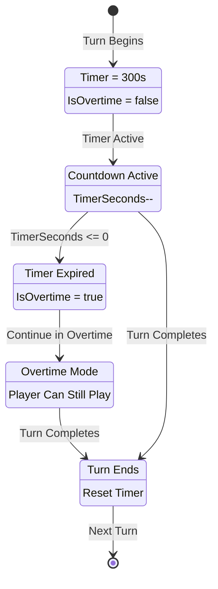

---

## Notes

### How to View These Diagrams

1. **GitHub/GitLab**: Diagrams render automatically in markdown files
2. **VS Code**: Install "Markdown Preview Mermaid Support" extension
3. **Online**: Use [Mermaid Live Editor](https://mermaid.live)
4. **Documentation Sites**: Most support Mermaid natively

### Diagram Types Used

- **Flowchart**: Linear and branching processes
- **State Diagram**: State machines and transitions
- **Sequence Diagram**: Interactions between components
- **Graph**: Network structures and relationships

