# Match Transactions System - Architecture Diagrams

## System Architecture Overview

## Transaction Flow During Gameplay

## Match Completion Flow

## Transaction Types and Data Model

## Transaction Type Flow

## Component Dependencies

## Final Score Calculation Logic

```mermaid
flowchart TD
    Start([Match Ends]) --> GetBalances[Get All Player Balances]
    GetBalances --> GetPieces[Get All Piece States]
    GetPieces --> GetPositions[Get Position Transactions]
    
    GetPositions --> LoopStart{For Each Player}
    LoopStart --> CalcBase[Base Score = Current Balance]
    CalcBase --> CountFinished[Count Finished Pieces]
    CountFinished --> CalcFinishedBonus[Finished Bonus = Count × 1000]
    
    CalcFinishedBonus --> SumDistance[Sum Total Distance]
    SumDistance --> CalcDistanceBonus[Distance Bonus = Distance × 10]
    
    CalcDistanceBonus --> CalcFinal[Final Score = Base + Finished Bonus + Distance Bonus]
    CalcFinal --> RecordScore[Record Final Score Transaction]
    RecordScore --> NextPlayer{More Players?}
    
    NextPlayer -->|Yes| LoopStart
    NextPlayer -->|No| ReturnScores[Return All Final Scores]
    ReturnScores --> End([Complete])
```

## Data Flow: Loot Transaction

## Integration Points

