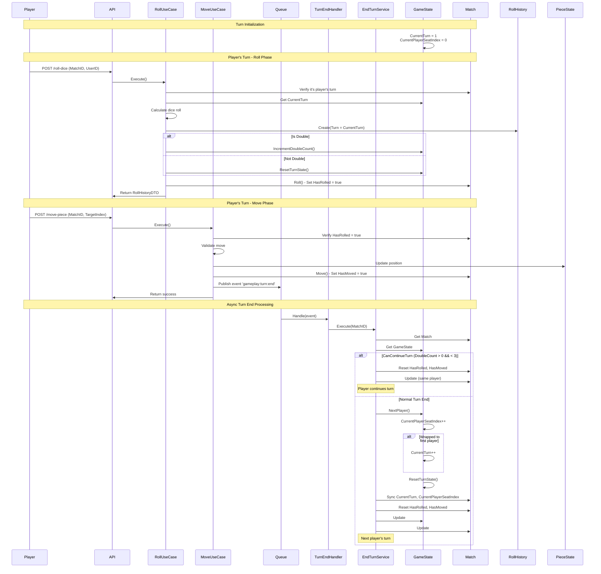
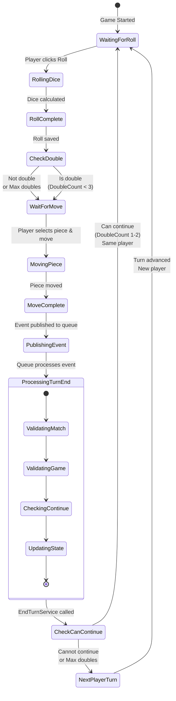

# Turn Management Workflow

## Overview
This document describes the workflow for managing player turns in the cá ngựa (Ludo) game.

## Workflow Diagram

```mermaid
graph TB
    Start([Game Starts]) --> InitTurn[Initialize Turn State]
    InitTurn --> SetTurn[Set CurrentTurn = 1<br/>Set CurrentPlayerSeatIndex = 0<br/>Reset DoubleCount = 0]
    SetTurn --> WaitForPlayer[Wait for Current Player]
    
    WaitForPlayer --> CheckTimer{Timer Expired?}
    CheckTimer -->|Yes| ForceEndTurn[Force End Turn]
    CheckTimer -->|No| PlayerAction[Player Action Required]
    
    PlayerAction --> RollDice[Roll Dice]
    RollDice --> SaveRollHistory[Save RollHistory<br/>with CurrentTurn]
    SaveRollHistory --> CheckDouble{Is Double?}
    
    CheckDouble -->|Yes| IncrementDouble[Increment DoubleCount]
    CheckDouble -->|No| ResetDouble[Reset DoubleCount = 0]
    
    IncrementDouble --> CheckMaxDouble{DoubleCount >= 3?}
    CheckMaxDouble -->|Yes| SetMaxReached[Mark: Max doubles reached<br/>Turn ends after move]
    CheckMaxDouble -->|No| SetHasRolled[Set HasRolled = true]
    
    ResetDouble --> SetHasRolled
    SetMaxReached --> SetHasRolled
    
    SetHasRolled --> WaitMove[Wait for Player Move]
    WaitMove --> MovePiece[Move Piece]
    MovePiece --> SetHasMoved[Set HasMoved = true]
    SetHasMoved --> PublishEvent[Publish Turn End Event<br/>to Queue: gameplay-turn]
    
    PublishEvent --> QueueHandler[Queue Handler Receives Event]
    QueueHandler --> EndTurnService[EndTurnService.Execute]
    
    EndTurnService --> CheckMatchStatus{Match Status = Started?}
    CheckMatchStatus -->|No| Exit1[Exit: Match not active]
    CheckMatchStatus -->|Yes| CheckGameStatus{Game Status = InProgress?}
    
    CheckGameStatus -->|No| Exit2[Exit: Game not in progress]
    CheckGameStatus -->|Yes| CheckCanContinue{CanContinueTurn?<br/>DoubleCount > 0 && < 3}
    
    CheckCanContinue -->|Yes| ResetForContinue[Reset HasRolled = false<br/>Reset HasMoved = false<br/>Keep same player]
    ResetForContinue --> UpdateMatch[Update Match State]
    UpdateMatch --> ContinueTurn([Same Player Continues Turn])
    
    CheckCanContinue -->|No| NextPlayer[NextPlayer<br/>Increment CurrentPlayerSeatIndex]
    NextPlayer --> CheckWrap{CurrentPlayerSeatIndex == 0?}
    
    CheckWrap -->|Yes| IncrementTurn[Increment CurrentTurn<br/>Reset DoubleCount]
    CheckWrap -->|No| ResetTurnState[Reset DoubleCount]
    
    IncrementTurn --> ResetMatchState[Reset HasRolled = false<br/>Reset HasMoved = false<br/>Sync Match with GameState]
    ResetTurnState --> ResetMatchState
    
    ResetMatchState --> CheckGameComplete{Check Game Completion<br/>TODO: Implement}
    CheckGameComplete --> UpdateGameState[Update GameState]
    UpdateGameState --> UpdateMatch
    UpdateMatch --> NextPlayerTurn([Next Player's Turn])
    
    ForceEndTurn --> NextPlayer
    ContinueTurn --> WaitForPlayer
    NextPlayerTurn --> WaitForPlayer
    
    style Start fill:#90EE90
    style ContinueTurn fill:#FFD700
    style NextPlayerTurn fill:#87CEEB
    style Exit1 fill:#FFB6C1
    style Exit2 fill:#FFB6C1
    style QueueHandler fill:#FFA500
    style EndTurnService fill:#FFA500
```



## Sequence Diagram



## State Diagram



## Key Components

### 1. Turn State Fields
- **CurrentTurn**: Increments when all players have had a turn
- **CurrentPlayerSeatIndex**: Index in PlayerOrder array (0-based)
- **DoubleCount**: Tracks consecutive doubles (0-3)
- **HasRolled**: Flag if current player has rolled
- **HasMoved**: Flag if current player has moved

### 2. Turn Flow Steps

1. **Initialization**: Set CurrentTurn = 1, CurrentPlayerSeatIndex = 0
2. **Roll Phase**: Player rolls dice, RollHistory saved with CurrentTurn
3. **Double Handling**: If double, increment DoubleCount; if DoubleCount >= 3, mark for turn end
4. **Move Phase**: Player moves piece, HasMoved set to true
5. **Turn End Event**: Publish event to queue for async processing
6. **Turn End Processing**: 
   - Check if player can continue (DoubleCount 1-2)
   - If continue: Reset flags, same player
   - If end: Advance to next player, increment turn if wrapped

### 3. Double Logic

```
DoubleCount = 0: Normal turn, ends after move
DoubleCount = 1-2: Player continues turn (roll again)
DoubleCount = 3: Max reached, turn ends after move
```

### 4. Queue Processing

- **Queue Name**: `gameplay-turn`
- **Event Name**: `gameplay:turn:end`
- **Handler**: `TurnEndEventHandler`
- **Service**: `EndTurnService.Execute()`

## Error Handling

- Invalid turn actions are rejected with appropriate error codes
- Queue failures are logged but don't fail the move operation
- Turn management can be retried via queue
- Game state is validated before turn transitions

